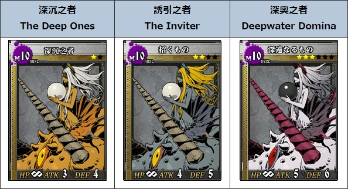
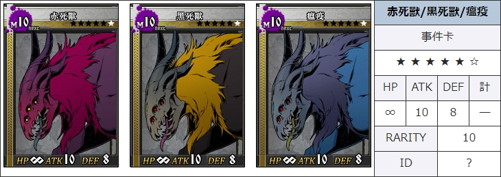

# 涡(Raid)攻略 #

[toc]

## 主要奖励 ##

### 不打死就什么都拿不到 ###

#### 涡1[^探1] ####

女王没有异矿[^图1]，其他则是发现奖励给1个异矿。每日登录小几率送。

#### 涡2[^探2] ####

妖精以外的：发现奖励给1个异矿。

妖精：有带异矿出门的和不带异矿出门的两种。

#### 涡3[^探3] ####

与涡2相同。

#### 涡4[^探4] ####

妖精：发现给随机魔材[^图2]和随机纹章[^图3]，排名给书签[^注1]，不给合金，排名没有魔材和纹章。

其他：发现给书签 + 魔材，排名25以上给随机纹章，排名100以上给合金[^图4]或魔材。

#### 附：涡探测器来源 ####

1、2：每日登录小几率送，月底清空。曾今暗房[^注2]能抽到探2。

3、4：氪金获得。（暂时可以无限生成）

注：α型已绝版。另外涡活动期间会有γ型活动期间限定涡探测器。

#### 按种类 ####

|种类|合金|魔材|备注|
|-|-|-|-|
|妖精[^图5]|无|随机|最简单，因为只有100血|
|海鲜[^图6]|突击|弹头|第二简单|
|虫[^图7]|强防|戒指||
|龟[^图8]、鱼[^图9]|防护|手镯|奖励相同因此大家都不爱打皮糙肉厚的龟，都选择打鱼|
|死兽[^图10]|强攻|刀身|最难打|
|女王|无|无|涡1限定，几乎等于没奖励，没人打|

## 流行的打法 ##

### 妖精 ###

#### 主要技能 ####

面对男性角色时让对方立即死亡，面对女性角色时放弃攻击并为对方恢复HP，面对非人类时不会有反应[^注3]。因此经常会被剧透。

#### 打法 ####

只有100血，几个人一人一口就没了，单刷也很快。随便打。

### 海鲜 ###

#### 主要技能 ####

##### 被动 #####

半血以下时，防御阶段最多只会受到20点骰伤，移动阶段受到的伤害翻倍。

##### 主动 #####

移动阶段 / 全距离 / 无1↑ 无1↑ 无1↑ / 获得1张特殊事件卡[^图11]：移动阶段使用，技能造成的伤害+20，本事件卡数值视为20。

#### 打法：猫鱼组 ####

使用L3以上猫([艾茵](https://w.atwiki.jp/unlight-fbtw/pages/52.html))，L3以上鱼哥([柯布](https://w.atwiki.jp/unlight-fbtw/pages/273.html))

**艾茵** *【一颗心】* 移动阶段 / 中距离 / 特3↑ / 偷取对方手牌中数值最大的卡。

面对海鲜时必定能偷到特殊事件卡。

Ex一颗心从中距离变成全距离。

4专[^注4]可以让发动条件由特3↑降低至特2↑。

**柯布** *【叫化盛宴】* 移动阶段 / 近·中距离 / 剑4↑ 枪4↑ / 对敌方队伍随机一人造成1点伤害，重复5次。

使用特殊事件卡将会变成造成21点伤害重复5次。

Ex叫化盛宴能够回收使用的牌中数值最大的牌（特殊事件卡），就是可以一张卡无限用。

事件卡以特殊为主，因为常常难以开局凑够特3[^注5]。

##### 推荐组法[^注6] #####

最后一个位置带了主动自杀并额外增加牌格[^注7]的角色：[音音梦](https://w.atwiki.jp/unlight-fbtw/pages/284.html)、[诺艾拉](https://w.atwiki.jp/unlight-fbtw/pages/441.html)。

# 黑话 #

[^探1]: β型涡探测器1

[^探2]: β型涡探测器2

[^探3]: β型涡探测器3

[^探4]: β型涡探测器4

[^注1]: 记忆的书签：在任务界面打开道具栏使用，可以搜索到能获得随机非氪金角色R1卡1张的任务。

[^注2]: Darkroom

[^注3]: 无敌的妖精小姐能看透所有人的性别

[^注4]: 合成武器(强化武器)与纹章合成制作的角色专用武器，只有L卡和R卡可以装备，复活卡不能装备。
[^注5]: 公共牌堆根据战斗场景改变，大多数战斗场景的公共牌堆里特殊卡都不多。
[^注6]: 推荐组法只贴出最高配置，可以替换为技能够用的低等级卡。
[^注7]: 手牌上限。回合开始时将会从公共牌堆抽取卡片直到达到这个上限。

# 附图 #

[^图1]: 

[^图2]: 

[^图3]: 

[^图4]: 

[^图5]: 
[^图6]: 

[^图7]: 

[^图8]: 

[^图9]: 

[^图10]: 

[^图11]: 
