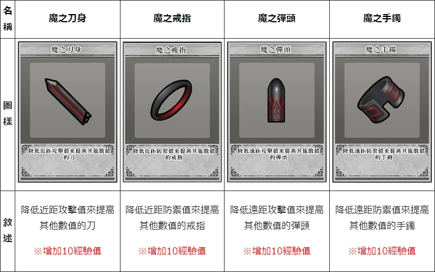

# 涡(Raid)攻略

目录

[toc]

# 主要奖励

**没打死就什么都拿不到**

## 涡1[^探1][探1](#探1)

女王没有异矿[^图1]，其他则是发现奖励给1个异矿。每日登录小几率送。

## 涡2[^探2]

妖精以外的：发现奖励给1个异矿。

妖精：有带异矿出门的和不带异矿出门的两种。

## 涡3[^探3]

与涡2相同。

## 涡4[^探4]

妖精：发现给随机魔材[^图2]和随机纹章[^图3]，排名给书签[^注1]，不给合金，排名没有魔材和纹章。

其他：发现给书签 + 魔材，排名25以上给随机纹章，排名100以上给合金[^图4]或魔材。

## 附：涡探测器来源

1、2：每日登录小几率送，月底清空。曾今暗房[^注2]能抽到探2。

3、4：氪金获得。（暂时可以无限生成）

注：α型已绝版，涡活动期间会有γ型（活动期间限定）。

## 按种类对应

|种类|HP|合金|魔材|备注|
|-|-|-|-|-|
|妖精[^图5]|100|无|随机|最简单，因为只有100血|
|海鲜[^图6]|550/1200/2000|突击|弹头|第二简单|
|虫[^图7]|550/1000/2000|强防|戒指||
|鱼[^图8]|550/1000/2000|防护|手镯||
|龟[^图9]|1200/6000/12000|防护|手镯|奖励跟鱼相同因此大家都不爱打皮糙肉厚的龟|
|死兽[^图10]|550/3500/6000|强攻|刀身|最难打。|
|女王|100|无|无|涡1限定，几乎等于没奖励，没人打|

# 流行的打法[^注:关于推荐组]

## 涡BOSS共通

### 被动技能

不会受到致命伤害（即死技能及HP变动技能按HP上限20结算），不会晕眩[^buff:晕眩][^图标:晕眩]，减轻诅咒[^buff:诅咒][^图标:诅咒]效果。

[伊芙琳](https://w.atwiki.jp/unlight-fbtw/pages/278.html)的[赤红石榴](https://w.atwiki.jp/unlight-fbtw/pages/278.html#id_a4f6be80)随机效果对涡BOSS有特殊处理：

|随机效果|实际效果|
|-|-|
|HP-1|BOSSHP-14|
|HP-3|BOSSHP-3|
|HP变为1|BOSSHP-140|
|HP变为5|BOSSHP-60|
|HP回满|BOSSHP+99|

### 其他特性

虽然妖精、海鲜、死兽都有黑格[^注3]，但它们都没带诅咒[^事件卡:诅咒]、毒杯[^事件卡:毒杯]。

## 妖精

### 主要技能

面对男性角色时让对方立即死亡，面对女性角色时放弃攻击并为对方恢复HP，面对非人类时不会有反应[^注4]。因此经常会被剧透。

### 打法

只有100血，几个人一人一口就没了，单刷也很快。随便打。

## 海鲜

### 主要技能

#### 被动

HP50%以下时进入夜雾：防御阶段最多只会受到20点骰伤，移动阶段受到的伤害翻倍。

#### 主动

移动阶段 / 全距离 / 无1↑ 无1↑ 无1↑ / 获得1张特殊事件卡[^图11]：移动阶段使用，技能造成的伤害+20，本事件卡数值视为20。

### 打法：猫鱼

使用L3以上猫([艾茵](https://w.atwiki.jp/unlight-fbtw/pages/52.html))，L3以上鱼哥([柯布](https://w.atwiki.jp/unlight-fbtw/pages/273.html))

**艾茵** 【[一颗心](https://w.atwiki.jp/unlight-fbtw/pages/52.html#id_e9229e0c)】 移动阶段 / 中距离 / 特3↑ / 偷取对方手牌中数值最大的卡。

面对海鲜时必定能偷到特殊事件卡。

Ex一颗心从中距离变成全距离。

4专[^注5]可以让发动条件由特3↑降低至特2↑。

**柯布** 【[叫化盛宴](https://w.atwiki.jp/unlight-fbtw/pages/273.html#id_0954d502)】 移动阶段 / 近·中距离 / 剑4↑ 枪4↑ / 对敌方队伍随机一人造成1点伤害，重复5次。

同时使用特殊事件卡将会改为造成(1+20)点伤害，重复5次合计**105点伤害**，海鲜半血以下时翻倍即合计**210点伤害**。

Ex叫化盛宴能够回收使用的牌中数值最大的牌（特殊事件卡），就是可以一张卡无限用。

事件卡以特殊为主，因为常常难以开局凑够特3[^注6]。

### 推荐组

剩下的位置带了主动自杀并额外增加牌格[^注7]的角色：[音音梦](https://w.atwiki.jp/unlight-fbtw/pages/284.html)([成长状态](https://w.atwiki.jp/unlight-fbtw/pages/284.html#id_27df2e3e)中使用[秘密苦药](https://w.atwiki.jp/unlight-fbtw/pages/284.html#id_cbc59dbc))、[诺艾拉](https://w.atwiki.jp/unlight-fbtw/pages/441.html)([冲击疗法](https://w.atwiki.jp/unlight-fbtw/pages/441.html#id_40cf8723))，这两个角色都需要L5/R1以上。

## 虫

### 主要技能

#### 被动

HP60%以下时潜伏地中（钻地）：DEF+20，在自己的攻击阶段受到的伤害变成7倍。

HP40%以下钻出来：ATK+7，受到的骰子伤害翻倍。

#### 主动

移动阶段 / 近·远距离 / 移2↑ / 将自己的出牌全部交给对手，夺取对手所有单面数值大于等于5的剑、枪卡。

移动阶段 / 全距离 / 移3↑ / 对对手造成2点伤害，这个伤害打倒敌人时，自己获得混沌[^buff:混沌][^图标:混沌]。

攻击阶段 / 全距离 / 特3↑ / 对手麻痹1回合，下回合移动阶段结束时距离与现在相同的话，对对手造成4/5/6点伤害。

### 打法：反弹

**注：现在更流行直接用通用打法(见下文)而不是反弹打法，两种打法完全相反，请尊重涡主的选择。**

施工中

## 鱼

### 主要技能

#### 主动

移动阶段 / 全距离 / 移3↑ / 自己与对手各抽1~3/3/4张卡，对手先抽。

攻击阶段 / 全距离 / 无1↑ 无1↑ 无1↑ / 这次战斗造成的伤害小于等于5时，对方手卡数值上升2/2/3，否则数值下降1/2/3，最多改变7张卡。

### 打法：直接用通用打法(见下文)

## 龟

### 主要技能

#### 被动

HP1/3以下时隐身：DEF+15，在自己的攻击阶段受到的伤害变成5倍。

#### 主动

移动阶段 / 全距离 / 移1= / 随机一种双面数值3的事件卡，发给自己和对手各2/2/3张。

防御阶段 / 近距离 / 盾3= 盾3= / DEF+盾数值×3/4/4，自身麻痹1回合。

### 打法：[通用打法](#通用打法)

### 打法：反弹（HP1/3以下）

施工中

## 死兽

### 主要技能

#### 被动

随机发动解放：解除自身的封印[^buff:封印][^图标:封印]状态。

现实时间10~19分、40~49分硬化：受到的物理伤害降低至1/4（尾数舍去），受到的特殊伤害翻倍。

现实时间20~29分、50~59分吸收：吸收对方的特殊攻击，并恢复自己最多5HP，受到的物理伤害翻倍。

硬化和吸收只影响攻击技能造成的骰子伤害，反伤技能、直伤不受影响，具体技能分类见[Google表格](https://docs.google.com/spreadsheets/d/1FK2RjusX2bHdAusvWapk8ZFJtnYUTs4h0yhtnQHxXSE/edit#gid=2043573874)（需翻墙）。

一般普通攻击为物理伤害，物理伤害技能与特殊伤害技能同时发动则最终伤害不受硬化和吸收影响，但吸收时死兽还是会回血。

#### 主动

## 通用打法

除了妖精和海鲜以外都可以用的方法。

1. 给涡BOSS贴上buff(异常状态)，通常必上39+狂战士（见下文）
2. 不断延长刷新buff持续时间
3. 硬揍（按着打）

这些操作不需要一个人完成，当然也可以一个人完成。

### 给涡BOSS上buff

涡的buff不是按回合，而是按现实时间的分钟计算持续，获得buff时会按1回合=1分钟换算为分钟，上限为9分钟。

### 39，或者叫999

指ATK↓9[^buff:ATK↓][^图标:ATK↓]、DEF↓9[^buff:DEF↓][^图标:DEF↓]、MOV↓9[^buff:MOV↓][^图标:MOV↓]

最重要的是MOV↓9：部分涡BOSS会刷新自己的麻痹[^buff:麻痹][^图标:麻痹]状态，因此通用做法是不使用麻痹而是用MOV↓9来使涡BOSS的移动力归0。

使用任何能够快速使对方获得**任意数值**的这三个buff的角色或怪物卡 + L5/R1以上[泰瑞尔](https://w.atwiki.jp/unlight-fbtw/pages/305.html)。

可以使用M3[妖精王妃](https://w.atwiki.jp/unlight-fbtw/pages/223.html#id_387789f7)、R1[弗雷特里西](https://w.atwiki.jp/unlight-fbtw/pages/55.html)([修罗架势](https://w.atwiki.jp/unlight-fbtw/pages/55.html#id_a6a10ab0))、[复活弗雷特里西](https://w.atwiki.jp/unlight-fbtw/pages/373.html)([修罗的奥义](https://w.atwiki.jp/unlight-fbtw/pages/373.html#id_1877fd93))。

也可以直接用泰瑞尔（就是看脸，因为很容易吸到重复的）。

**泰瑞尔** 【[Chr·799](https://w.atwiki.jp/unlight-fbtw/pages/305.html#id_c74e5cf9)】 攻击阶段 / 中·远距离 / 枪2↑ 特2↑ / 吸收对方ATK·DEF·MOV中随机一种能力。

实际效果是自己获得能力上升，对方获得能力下降的buff。

会覆盖掉旧buff，使其数值和持续时间变为此技能效果的数值和持续时间。

**泰瑞尔** 【[Wil·846](https://w.atwiki.jp/unlight-fbtw/pages/305.html#id_1fcc0fe5)】 攻击阶段 / 远距离 / 剑3↑ 枪3↑ / 使双方的ATK·DEF·MOV状态，无论上升下降，强度(数值)全部变为9。

在对方同时有任意数值的ATK↓ + DEF↓ + MOV↓时发动即可使其变为ATK↓9 + DEF↓9 + MOV↓9。

不会覆盖旧buff：不会刷新剩余回合数，但对涡BOSS会刷新buff持续时间。

### 狂战士[^buff:狂战士][^图标:狂战士]

使用R4以上[玛格丽特](https://w.atwiki.jp/unlight-fbtw/pages/56.html)/[复活玛格丽特](https://w.atwiki.jp/unlight-fbtw/pages/413.html)

**玛格丽特** 【[Ex末日幻影](https://w.atwiki.jp/unlight-fbtw/pages/56.html#id_0b66e462)】 移动阶段 / 全距离 / 剑1↑ 枪1↑ / 根据移动后的距离使对方获得异常状态。

非Ex的末日幻影不能出移动卡，嫌麻烦就用复活吧。

移动到远距离即可使对方获得狂战士。

**无论如何都不要移动到近距离使对方获得恐惧[^buff:恐惧][^图标:恐惧]。**

### 傀儡[^buff:傀儡][^图标:傀儡]

打虫必上，阻止它获得混沌、夺取玩家手牌。

# 注释与黑话

<a name="探1">探1</a>: β型涡探测器1

[^探1]: β型涡探测器1
[^探2]: β型涡探测器2
[^探3]: β型涡探测器3
[^探4]: β型涡探测器4
[^注:关于推荐组]: 推荐组只贴出最高配置，可以替换为技能够用的低等级卡。
[^注1]: 记忆的书签：在任务界面打开道具栏使用，可以搜索到能获得随机非氪金角色R1卡1张的任务。
[^注2]: Darkroom
[^注3]: 有底色的事件卡格子
[^注4]: 无敌的妖精小姐能看透所有人的性别
[^注5]: 合成武器(强化武器)与纹章合成制作的角色专用武器，只有L卡和R卡可以装备，复活卡不能装备。
[^注6]: 公共牌堆根据战斗场景改变，大多数战斗场景的公共牌堆里特殊卡都不多。
[^注7]: 手牌上限。回合开始时将会从公共牌堆抽取卡片直到达到这个上限。
[^事件卡:机会]: 抽取X张卡片
[^事件卡:诅咒]: 破坏对方X张手卡，不能在移动阶段使用。
[^事件卡:圣水]: 解除自己所有异常状态
[^事件卡:圣杯]: 抽1张卡，解除自己所有异常状态。
[^事件卡:毒杯]: 破坏对方1张手卡，解除对方所有异常状态。
[^buff:atk↑]: 攻击力上升
[^buff:atk↓]: 攻击力下降
[^buff:def↑]: 防御力上升
[^buff:def↓]: 防御力下降
[^buff:mov↑]: 移动力上升，不出移动卡也会有上升的移动力。
[^buff:mov↓]: 移动力下降
[^buff:狂战士]: 造成与受到的骰子伤害翻倍
[^buff:恐惧]: 造成与受到的骰子伤害减半，尾数舍去。
[^buff:傀儡]: 无法在移动阶段发动技能
[^buff:混沌]: 攻击力和防御力翻倍
[^buff:麻痹]: 移动力归0
[^buff:诅咒]: 造成的骰子伤害被限制在最多（10-层数）点，对涡BOSS为限制在最多（10-层数÷2）点。
[^buff:能力低下]: 每层使ATK与DEF各-1，最高堆叠9层，没有持续时间（不会自然解除(涡BOSS除外)）。
[^buff:毒]: 移动阶段结束时受到1点伤害
[^buff:猛毒]: 复活伯恩哈德特有，移动阶段结束时受到2点伤害。
[^buff:临界]: 尤莉卡特有，依层数增加ATK和DEF，最高3层，没有持续时间（不会自然解除）。
[^buff:傀儡]: 维若妮卡特有，无法在移动阶段发动技能。
[^buff:再生]: 移动阶段恢复1HP，中毒时会先受到中毒伤害。
[^buff:咒缚]: 距离改变时，受到与移动距离等值的伤害。
[^buff:圣痕]: 每层使ATK与DEF各+1，最高堆叠9层，没有持续时间（不会自然解除）。
[^buff:封印]: 无法发动技能
[^buff:自坏]: 移动阶段结束时减少回合数，减少至0时立即死亡（被消除除外）。
[^buff:操想]: 诺伊库洛姆特有，效果等同于自坏，不同的是操想即使不在场上也会倒数、无法被任何手段消除。
[^buff:断绝]: 无法恢复生命，会变动HP导致HP上升的技能也会被无效（迷迭香、温柔注射、灵魂仿制，etc.）。
[^buff:晕眩]: 无法行动。实际上是不能出牌。
[^buff:标靶]: 克洛维斯特有，没有持续时间（不会自然解除）。
[^buff:棍术atk]: 康拉德特有，攻击力翻倍，康拉德发动技能时会将其切换为棍术(def)。
[^buff:棍术def]: 康拉德特有，防御力翻倍，康拉德发动技能时会将其切换为棍术(atk)。

# 物理技能与特殊技能

## 物理技能

## 特殊技能

## 无分类（不受硬化和吸收影响）

|来自|技能|
|-|-|
|馬庫斯|自爆|
|沃肯|安樂死之歌|
|帕茉|慈悲的藍眼|
|聖櫃|殘象劍|

## 未测试

|来自|技能|
|-|-|
|渦的觀測者|犧牲的一擊|

# 附图

[^图1]: 
[^图2]: 
[^图3]: 
[^图4]: 
[^图5]: 
[^图6]: 
[^图7]: 
[^图8]: 
[^图9]: 
[^图10]: 
[^图11]: 
[^图标:atk↑]: 
[^图标:atk↓]: 
[^图标:def↑]: 
[^图标:def↓]: 
[^图标:mov↑]: 
[^图标:mov↓]: 
[^图标:狂战士]: 
[^图标:恐惧]: 
[^图标:傀儡]: 
[^图标:混沌]: 
[^图标:麻痹]: 
[^图标:诅咒]: 
[^图标:能力低下]: 
[^图标:毒]: 
[^图标:猛毒]: 
[^图标:临界]: 
[^图标:傀儡]: 
[^图标:再生]: 
[^图标:咒缚]: 
[^图标:圣痕]: 
[^图标:封印]: 
[^图标:自坏]: 
[^图标:操想]: 
[^图标:断绝]: 
[^图标:晕眩]: 
[^图标:标靶]: 
[^图标:棍术atk]: 
[^图标:棍术def]: 