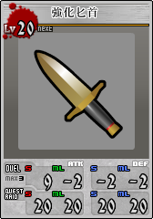
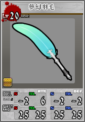

**强化武器攻略 | Unlight**

    
    

目录

[toc]

# 为什么要做强化武器？（我能获得什么？）

## 通用强化武器

* 所有角色&怪物都可以装备。

* 通用数值（第一行）合计值上限2，添加琉璃宝玉可提升至合计值上限3。4项数值可自由调整。
* 任务&涡专用数值（第二行）各20点。（上限为当前等级，武器等级上限为20）

## 专用强化武器

* 只有特定角色的L卡和R卡可以装备，复活卡不能
* 通用数值与通武相同

* 任务&涡专用数值在通武的基础上额外各5点，即最大为4项各25。

* 附带角色专属被动技能，减少技能的发动消耗。

